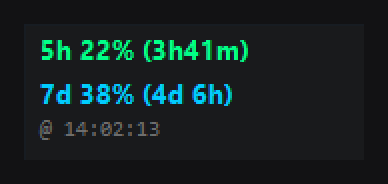
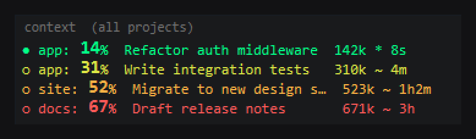

<div align="right"><a href="README_TR.md">🇹🇷 Türkçe</a></div>

# claude-usage-widgets

Three tiny, always-on-top desktop widgets for **Windows 10/11** that show how much Claude
headroom you have left — at a glance, with **zero installs**.

**Runs as-is — no Python, no Node, no pip, nothing to install.** Double-click and go: the
widgets use only what already ships with Windows (.NET WinForms + `curl.exe`).

**5h** &nbsp;·&nbsp; **Context** &nbsp;·&nbsp; **Combined**






<sub>Pick one. Top: the 5-hour rate-limit (with the optional **7-day** row shown). Middle:
per-session context %. Bottom: both together. (Anonymized sample data.)</sub>

| Widget | Launch | Shows | Needs `.env`? |
|--------|--------|-------|---------------|
| **5h** | `widgets/5h/cuw.bat` | The shared **5-hour** rate-limit % **and the 7-day (weekly) limit** | Yes |
| **Context** | `widgets/context/ctw.bat` | Per-session **context-window %** (how full each session's 1M window is) | No |
| **Combined** | `widgets/combined/ccw.bat` | Both of the above in one window | Yes |

Run **one** of the three — each has its own single-instance lock, so they won't stack, but
they'd overlap on screen. Most people want **Combined** (`widgets/combined/ccw.bat`).


---

## The two "walls" these track

Claude has separate limits, and these widgets show them:

1. **5-hour rate limit** — the shared, account-wide usage pool (`5h 42% (1h58m)`). When it
   hits 100% you're paused until it resets. The widget fetches this from claude.ai.
2. **7-day (weekly) limit** — the longer rolling cap (`7d 38% (4d 6h)`), shown on the 5h and
   combined widgets via **Show 7d**. Some accounts don't have a weekly limit; for those the
   row reads `7d n/a`.
3. **Context window** — how full *each individual session's* 1M-token context is
   (`Dev: 18% Access Claude chat… 180k * 2m`). When it fills, that session degrades / needs
   `/compact`. The widget reads this straight from the session transcript on disk.

---

## How the context number works (and why it's safe)

The context widget reads the **real token usage that Claude Code already writes** into each
session's `.jsonl` transcript (the `usage` block on every assistant turn:
`input + cache_creation + cache_read` = the true context that turn carried — the actual
tokenizer count from the API, not an estimate).

It does this by reading only the **last 64 KB** of each transcript (a byte seek, not a full
read), so it's instant even on multi-megabyte files. Crucially:

> **The context widget never runs `claude`, never forks a session, never spawns anything.**
> It only reads local files. So it cannot consume any of your 5h pool and cannot freeze.

Session **titles** (the real `/resume` picker names) load **lazily in a background thread** —
the window paints instantly with short ids, then the titles fill in (~200 ms). Nothing blocks.

> **`/compact` caveat:** right after a compaction, a session's transcript still ends with the
> *pre-compaction* peak until a few new turns land. The number self-corrects as the session
> continues. (This is why the context read stays purely local — no spawning to "fix" it.)

---

## Setup

### 1. Credentials (only for the 5h / combined widgets)

Copy [`claude_usage.env.example`](claude_usage.env.example) to
`%USERPROFILE%\.claude\claude_usage.env` and fill in three values from your logged-in
claude.ai browser session:

- `SESSION_KEY` — the `sessionKey` cookie (`sk-ant-sid01-…`)
- `ORG_ID` — your organization UUID (from any `/api/organizations/<ID>/…` request)
- `DEVICE_ID` — the `anthropic-device-id` cookie (optional but recommended)

The `.env.example` has step-by-step DevTools instructions. **The context widget (`ctw.bat`)
needs none of this** — it reads local transcripts only.

> Why `curl` and not PowerShell's `Invoke-RestMethod`? `claude.ai` is behind Cloudflare, which
> 403-challenges PowerShell's .NET TLS stack but lets `curl.exe` through.

### 2. Run

Double-click the launcher for the widget you want, under `widgets/`:
**`widgets/combined/ccw.bat`** (combined), `widgets/5h/cuw.bat` (5h), or
`widgets/context/ctw.bat` (context). It appears top-right. (Each widget's `.bat`, `.vbs`, and
`.ps1` live together in one folder — keep the trio together if you move it.)

### 3. Optional — run at startup

<kbd>Win</kbd>+<kbd>R</kbd> → `shell:startup` → drop a shortcut to your chosen `.bat` there.

---

## Using the widgets

- **Drag** with the left mouse button to move (position persists per widget).
- **Left-click** (5h / combined): toggle the reset display between remaining (`1h58m`) and
  exact clock (`@14:30`).
- **Right-click** for the menu: Refresh now · Show 7d (5h/combined) · Lock position ·
  Legend / Help · Quit.

### Reading the context rows

```
● Dev: 18% Access Claude chat conte…  180k * 2m
○ mm:  48% Reorganize Python projec…  476k ~ 2h
```

- **●** touched in the last 60 s (active) · **○** idle but recently touched
- the **big %** = how full that session's 1M window is (color-gated)
- `180k` = real tokens used · `*` active / `~` idle · `2m` = since last written
- `reading` = a brand-new session with no usage block in its tail yet

**Color gates** (both the 5h and context %): green → yellow → amber → red as it fills.
Context gates are the compaction thresholds: green `<30%` · yellow `<50%` · amber `<60%` ·
red `≥60%`.

---

## Failsafes

- **`(RL)` = rate-limited.** If the 5h API returns HTTP 403, the widget keeps the **last good
  numbers**, appends `(RL)`, and retries after 60 s — it never goes blank.
- **`401 refresh .env`** — your session expired; refresh the credentials.
- **`offline` / `http NNN`** — network/server issue; keeps the last good value if it has one.
- **Off-thread fetch** — the 5h curl call runs off the UI thread, so the widget never freezes
  even on a slow network.

---

## "Running scripts is disabled on this system"

Windows blocks `.ps1` files by default — **you don't need to change any system setting.** The
`.vbs`/`.bat` launchers call PowerShell with `-ExecutionPolicy Bypass` for that **one launch
only** (no admin, nothing permanent). Always start via the **`.bat`**, not the `.ps1`.

---

## Layout

```
claude-usage-widgets/
├─ widgets/
│  ├─ 5h/        usage-widget.ps1   + cuw.bat / cuw.vbs
│  ├─ context/   context-widget.ps1 + ctw.bat / ctw.vbs
│  └─ combined/  combined-widget.ps1 + ccw.bat / ccw.vbs
├─ images/       screenshots
├─ docs/         README_5h_EN.md / README_5h_TR.md  (5h deep-dive)
├─ claude_usage.env.example   credential template (copy → ~/.claude/claude_usage.env)
├─ README.md / README_TR.md   this file (EN / TR)
└─ LICENSE
```

Each widget is **self-contained** in its folder (the `.bat` launches the sibling `.vbs`, which
launches the sibling `.ps1`). Move a folder anywhere and it still works — just keep the three
files together.

Each widget runs as `powershell.exe` (no separate `.exe`). Right-click → **Quit** to close, or
match its command line (`*combined-widget.ps1*` etc.) to force-kill just that one. Launching a
`.bat` twice does nothing — a named mutex keeps a single instance.

---

## Privacy & security

- `SESSION_KEY` is a **live login token** — treat the filled-in `.env` like a password. The
  included [`.gitignore`](.gitignore) keeps `*.env` (and per-user config/cache) out of git;
  only the `.example` is tracked.
- Nothing is sent anywhere except the 5h read to `claude.ai`. The context widget makes **no
  network calls at all** — it only reads your local transcripts.

---

## Credits

The original idea and first working prototype came from
**[Ne7erStop](https://github.com/Ne7erStop)**, who built the initial version in
Python. This project grew out of that concept — thanks to him for the spark.

---

## License

MIT — see `LICENSE`.
